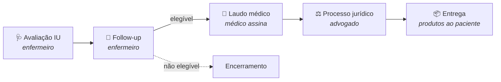
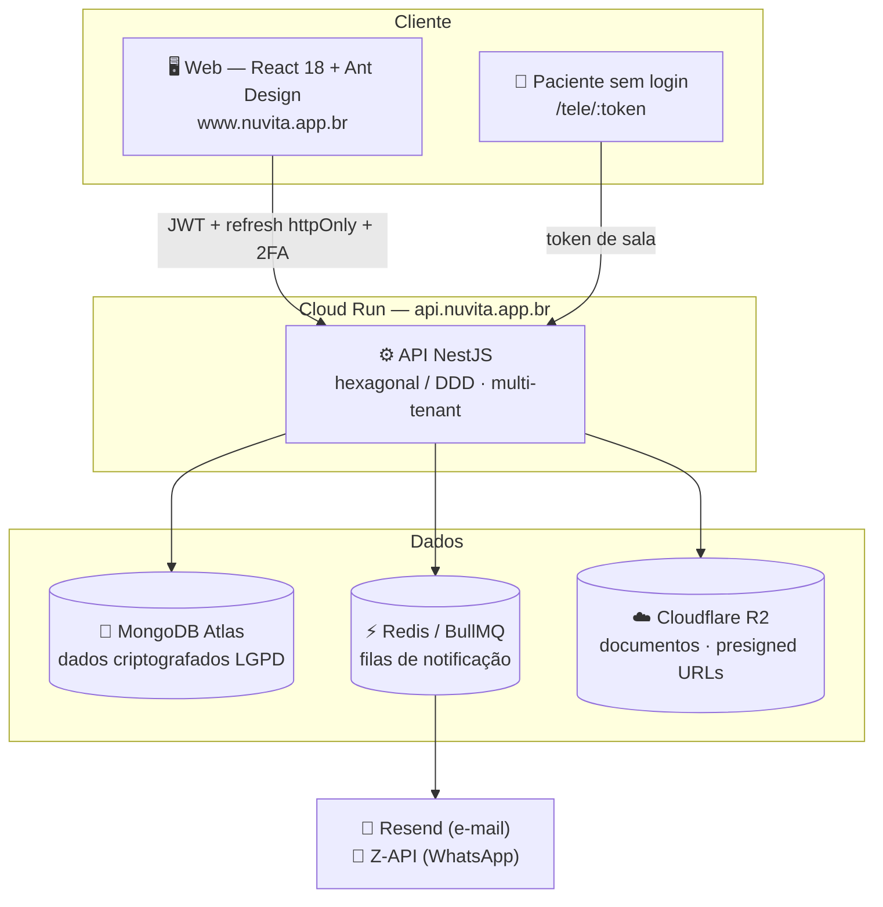

<div align="center">

<picture>
  <source media="(prefers-color-scheme: dark)" srcset="apps/web/src/assets/nuvita-logo-light.png">
  
</picture>

### Gestão de saúde na nuvem

**Plataforma SaaS multi-tenant de gestão clínica** — do agendamento ao prontuário assinado,
da telemedicina ao fornecimento de produtos pelo SUS.

[](https://github.com/ericolimaeducador-ux/nuvita/actions/workflows/ci.yml)
[](https://github.com/ericolimaeducador-ux/nuvita/actions/workflows/deploy-api.yml)
[](https://github.com/ericolimaeducador-ux/nuvita/actions/workflows/deploy-pages.yml)

[**www.nuvita.app.br**](https://www.nuvita.app.br) · [API `api.nuvita.app.br`](https://api.nuvita.app.br/health)

[Funcionalidades](#-funcionalidades) ·
[Fluxo clínico](#-o-fluxo-clínico-pipeline-de-incontinência-urinária) ·
[Arquitetura](#%EF%B8%8F-arquitetura) ·
[Segurança](#-segurança--lgpd) ·
[Rodando localmente](#-rodando-localmente) ·
[Documentação](#-documentação-complementar)

</div>

---

## 💡 O que é o Nuvita

O **Nuvita** é uma plataforma completa de gestão clínica na nuvem, projetada para
clínicas e equipes multidisciplinares (médicos, enfermeiros, psicólogos, advogados
e secretariado). Além dos módulos clássicos de gestão — pacientes, agenda,
prontuário eletrônico, financeiro e telemedicina — o Nuvita implementa um fluxo
especializado e único: o **pipeline de atendimento de incontinência urinária**,
que acompanha o paciente da avaliação de enfermagem até o fornecimento do produto
pelo SUS, passando por follow-up de elegibilidade, laudo médico assinado
digitalmente, processo jurídico e entrega.

Cada clínica é um **tenant isolado**: dados, usuários, agenda e financeiro são
segregados por clínica, com um painel **super-admin** global para provisionamento
e gestão fina de permissões.

## ✨ Funcionalidades

### Gestão clínica

| Módulo | O que faz |
|---|---|
| 🧑‍⚕️ **Pacientes** | Cadastro completo com **criptografia de dados pessoais (LGPD)** em repouso; busca por hash cego; observações clínicas |
| 📅 **Agenda** | Calendário por profissional e visão geral da clínica; cada profissional vê a própria agenda; status de atendimento |
| 📋 **Prontuário eletrônico** | Evoluções **SOAP** e consulta de enfermagem; **assinatura digital imutável** — prontuário assinado não se altera, correções entram como addendum |
| 🧠 **Psicologia** | Sessão com vídeo e prontuário lado a lado; financeiro por **ciclos de 4 sessões**; sessão atual no dashboard |
| 🎥 **Telemedicina** | Vídeo **WebRTC P2P** com sinalização própria; paciente entra **sem login** via link tokenizado (`/tele/:token`); eventos de sala auditados |
| 📄 **Documentos** | Upload/download seguro via **presigned URLs** (Cloudflare R2/S3); checklist de documentos por paciente |
| 💰 **Financeiro** | Lançamentos, recebimentos e visão por competência; integração com ciclos de sessões |
| 🔔 **Notificações** | E-mail (Resend) e **WhatsApp** (Z-API/Evolution/Twilio) processados por **fila** (BullMQ), com janela de envio 8h–22h |
| 📊 **Analytics** | Painéis e indicadores operacionais da clínica |
| 🛒 **Produtos** | Catálogo dos produtos (cateteres etc.) indicados no fluxo clínico |

### Pipeline de incontinência urinária (diferencial)

| Etapa | Módulo | Responsável |
|---|---|---|
| 1. Avaliação IU | `avaliacao-iu` | Enfermeiro preenche a ficha e indica o produto |
| 2. Follow-up | `followup` | Enfermeiro acompanha e define **elegibilidade** |
| 3. Laudo médico | `laudo-medico` | Médico emite e **assina** o laudo para solicitação ao SUS |
| 4. Processo jurídico | `processo-juridico` + `anotacoes-juridicas` | Advogado protocola e acompanha a ação de fornecimento |
| 5. Entrega | `entregas` | Registro dos produtos enviados ao paciente |

Secretária e admin enxergam o pipeline (leitura); as **mutações são restritas ao
papel responsável** por cada etapa. Laudo, ficha de avaliação e relatório NAT-JUS
têm páginas de impressão dedicadas (rotas `/imprimir`, fora do layout do app,
com **timbre oficial** e prontas para PDF pelo navegador).

### Administração e acesso

- **Papéis**: `SUPER_ADMIN`, `ADMIN`, `MEDICO`, `ENFERMEIRO`, `ADVOGADO`,
  `SECRETARIA`, `PACIENTE`.
- **2FA TOTP obrigatório** para super-admin, admin e profissionais.
- **Permissões por módulo** (`packages/shared/src/auth/permissao.ts`): cada papel
  tem um conjunto padrão; o super-admin concede/revoga **exceções por usuário**
  (o banco guarda apenas as exceções e `resolvePermissoes()` calcula o efetivo).
  Frontend e API compartilham a mesma regra via `packages/shared`.
- **Multi-tenancy**: quase toda rota exige tenant (clínica) resolvido por
  `TenantMiddleware` + `TenantRequiredGuard`; rotas globais usam
  `@AllowWithoutTenant`.

## 🏥 O fluxo clínico (pipeline de incontinência urinária)



## 🏗️ Arquitetura

### Stack

| Camada | Tecnologias |
|---|---|
| **API** | NestJS 10 · TypeScript · MongoDB (Mongoose) · Redis + BullMQ (filas) |
| **Web** | React 18 · Vite · TypeScript · Ant Design 5 (pt-BR) · React Router 6 · TanStack Query · axios |
| **Infra** | Docker Compose (dev) · Cloud Run (API) · GitHub Pages + Firebase Hosting (web/api) · Cloudflare R2/S3 (documentos) |
| **Segurança** | JWT access + refresh httpOnly · 2FA TOTP · bcrypt · Helmet/CSP/HSTS · criptografia de dados de paciente (LGPD) |

### Estrutura do monorepo (npm workspaces)

```text
apps/api          API NestJS (workspace @nuvita/api)
apps/web          Frontend React (workspace @nuvita/web)
packages/shared   Contratos, enums e regras compartilhadas (papéis, permissões)
scripts/          Bootstrap, seeds de demonstração e utilitários (TOTP, GCP)
infra/            Notas de integração e PRODUCTION-CHECKLIST.md
docs/inpi/        Dossiês de registro de marca e de software no INPI
```

### API — arquitetura hexagonal / DDD

Cada módulo em `apps/api/src/modules/<nome>/` segue a mesma anatomia:

```text
domain/           Entidades e regras de negócio puras
application/      Casos de uso (services) + ports (interfaces) + DTOs
infrastructure/   Adapters: Mongoose (schemas/repos), S3, filas, provedores
presentation/     Controllers, guards e decorators HTTP
```

Módulos: `auth`, `clinicas`, `pacientes`, `agendamentos`, `prontuarios`,
`documentos`, `notificacoes`, `financeiro`, `telemedicina`, `analytics`,
`produtos`, `avaliacao-iu`, `followup`, `laudo-medico`, `processo-juridico`,
`entregas`, `anotacoes-juridicas`, `checklist-documentos`,
`observacoes-paciente`, `super-admin`, `health` — mais `common/tenancy`
(resolução de tenant por request) e `common/security`.



## 🔐 Segurança & LGPD

- **Dados de paciente criptografados** em repouso (`PATIENT_DATA_ENCRYPTION_KEY`),
  com hash cego (`PATIENT_DATA_HASH_KEY`) para busca sem descriptografar.
- **Prontuário assinado é imutável** (`PRONTUARIO_SIGNATURE_SECRET`) — qualquer
  correção entra como addendum, preservando a trilha de auditoria.
- **Autenticação**: JWT de acesso curto + refresh em cookie `httpOnly`
  (`path=/auth`), senhas com bcrypt e **2FA TOTP obrigatório** para papéis
  privilegiados.
- **Hardening HTTP**: Helmet, CSP e HSTS ligados em produção; Swagger fechado
  fora de desenvolvimento.
- **Segredos**: `CONFIG_SOURCE` desacopla a fonte de segredos do `NODE_ENV` —
  produção usa **GCP Secret Manager**; nada de segredo em repositório.
- **Deploy sem chave**: CD autentica no GCP via **Workload Identity Federation**.

## 🚀 Rodando localmente

Pré-requisitos: **Node 20+**, **Docker** (para MongoDB e Redis) e npm.

```bash
git clone https://github.com/ericolimaeducador-ux/nuvita.git
cd nuvita
npm install

# 1) Infra de dev (MongoDB 7 + Redis 7)
docker compose up -d mongodb redis

# 2) Configuração da API — o dev server lê apps/api/.env
cp .env.example apps/api/.env
#    Preencha ao menos JWT_*_SECRET, PATIENT_DATA_ENCRYPTION_KEY (32 bytes
#    base64), PATIENT_DATA_HASH_KEY, PRONTUARIO_SIGNATURE_SECRET e
#    BOOTSTRAP_SECRET. Gerador rápido:
node -e "console.log(require('crypto').randomBytes(32).toString('base64'))"

# 3) API (http://localhost:3000 — Swagger em /docs no modo development)
npm run api:dev

# 4) Web (http://localhost:5173, proxy para a API)
npm run dev -w @nuvita/web
```

> ⚠️ **Atenção ao `.env`**: `apps/api/.env` é o que a API carrega em dev
> (`envFilePath: ['.env.local', '.env']` relativo a `apps/api`). O `.env` da
> raiz alimenta só o `docker compose`. Nunca aponte o dev local para banco de
> produção — se precisar sobrescrever pontualmente:
> `MONGODB_URI="mongodb://localhost:27017/nuvita" npm run api:dev`.

### Dados de demonstração

```bash
# Cria clínica + admin (direto no Mongo, sem depender da API)
node scripts/bootstrap-direto.mjs

# Popula o pipeline completo: 10 pacientes, avaliações, follow-ups,
# laudos assinados, processos e entregas + equipe (médico, enfermeiro,
# advogado, secretária). Requer BOOTSTRAP_SECRET no ambiente.
BOOTSTRAP_SECRET="<o mesmo do .env>" node scripts/seed-fluxo-clinico.mjs
```

O seed cria a equipe com senha `SenhaForte123!` e segredo TOTP de
desenvolvimento compartilhado (`JBSWY3DPEHPK3PXP` — **apenas dev**). Para
gerar o código 2FA na hora do login:

```bash
node scripts/totp.mjs   # imprime o código TOTP atual
```

### Stack completa via Docker

```bash
cp .env.example .env    # docker compose lê o .env da raiz
docker compose up -d    # mongodb + redis + api (:3000) + web via nginx (:8080)
```

## 📏 Convenções importantes (leia antes de mexer)

- **`packages/shared` é importado por caminho relativo** (ex.:
  `../../../../packages/shared/src/auth`), não por alias. Por isso o build da
  API emite em `dist/apps/api/src/main.js` — o script `start` já aponta pra lá.
- **A API não tem prefixo `/api`**: o front chama `/auth`, `/pacientes`,
  `/followup`… e o proxy (Vite em dev, nginx em produção) encaminha esses
  paths para a API preservando-os. Isso é necessário porque o cookie httpOnly
  de refresh tem `path=/auth`. Como as rotas do SPA colidem com as da API, o
  proxy distingue navegação (Accept: text/html → SPA) de XHR (→ API).
- **Validação global**: `ValidationPipe` com `whitelist` +
  `forbidNonWhitelisted` + `transform` — todo body precisa de DTO com
  decorators; campo desconhecido derruba a request com 400.
- **Datas-calendário** (campos de `<input type="date">`) são gravadas como
  meia-noite UTC; no front, exiba com `formatData()` de `apps/web/src/utils.ts`
  (formatar com dayjs local mostraria o dia anterior no fuso do Brasil).
  Timestamps de evento (`criadoEm`, `dataProtocolo`…) usam dayjs local normal.
- **Prontuário assinado é imutável** — correções entram como addendum.
- **Identidade visual**: fonte única de marca em `apps/web/src/lib/brand.ts`
  (logos, CNPJ, endereço); documentos impressos usam
  `DocumentoTimbre`/`DocumentoRodape`.
- **Commits**: conventional commits em pt-BR (`fix(followup): …`,
  `feat(web): …`), como no histórico.

## ✅ Qualidade e CI/CD

```bash
npm run build -w @nuvita/api        # build (o workspace api não tem typecheck)
npm test  -w @nuvita/api            # testes da API
npm run typecheck -w @nuvita/web    # tsc --noEmit do front
npm run build -w @nuvita/web        # build de produção do front
```

- **CI** (`.github/workflows/ci.yml`): roda em pushes/PRs para `main` e
  `integracao` — build/type-check/testes da API e build do web.
- **CD da API** (`deploy-api.yml`): push em `main` faz deploy no **Cloud Run**
  (região `southamerica-east1`) autenticando via **Workload Identity
  Federation** (sem chave de service account). Env de produção gerado por
  `node scripts/gen-cloudrun-env.cjs` (liga `NODE_ENV=production`, CSP/HSTS,
  fecha o Swagger).
- **CD do Web** (`deploy-pages.yml`): push em `main` publica no GitHub Pages
  (domínio `www.nuvita.app.br`; API em `api.nuvita.app.br` via Firebase
  Hosting → Cloud Run).
- Pendências de go-live e rotação de segredos: veja
  [`infra/PRODUCTION-CHECKLIST.md`](infra/PRODUCTION-CHECKLIST.md).

## ⚙️ Variáveis de ambiente (principais)

| Variável | Para quê |
|---|---|
| `MONGODB_URI` / `REDIS_URL` | Banco e fila |
| `JWT_ACCESS_SECRET` / `JWT_REFRESH_SECRET` | Tokens de sessão |
| `PATIENT_DATA_ENCRYPTION_KEY` / `PATIENT_DATA_HASH_KEY` | Criptografia LGPD dos dados de paciente (32 bytes base64) |
| `PRONTUARIO_SIGNATURE_SECRET` | Assinatura imutável de prontuários/laudos |
| `BOOTSTRAP_SECRET` | Autoriza o bootstrap inicial de clínica+admin |
| `NODE_ENV` + `CONFIG_SOURCE` | Postura de segurança × fonte de segredos (env ou GCP Secret Manager) — independentes |
| `ALLOW_PUBLIC_REGISTRATION` | Habilita `/auth/register` público (desligado em produção por padrão) |
| `DOCUMENT_STORAGE_*` | Bucket S3/R2 de documentos (presigned URLs) |
| `RESEND_API_KEY`, `EVOLUTION_*`/`TWILIO_*` | Provedores de e-mail e WhatsApp das notificações |
| `CORS_ORIGIN` | Origens permitidas do front |

A lista completa e comentada está em [`.env.example`](.env.example).
**Nunca** commite segredos; produção usa GCP Secret Manager ou
`--env-vars-file` do Cloud Run.

## 📚 Documentação complementar

- [`apps/web/README.md`](apps/web/README.md) — detalhes do frontend
- [`infra/`](infra/) — notas de integração por módulo (auth, documentos,
  notificações, pacientes, prontuários) e checklist de produção
- [`docs/inpi/`](docs/inpi/) — dossiês de **registro da marca Nuvita** e de
  **registro do software** junto ao INPI

## 📄 Propriedade intelectual

© Nuvita — CNPJ 55.747.955/0001-07 · Rua Levindo Lopes, 391 – Funcionários,
Belo Horizonte/MG. Software proprietário; todos os direitos reservados.
Este repositório não concede licença de uso, cópia ou distribuição.

---

<div align="center">
<sub>Feito com 💚 em Belo Horizonte · <b>Nuvita — gestão de saúde na nuvem</b></sub>
</div>
